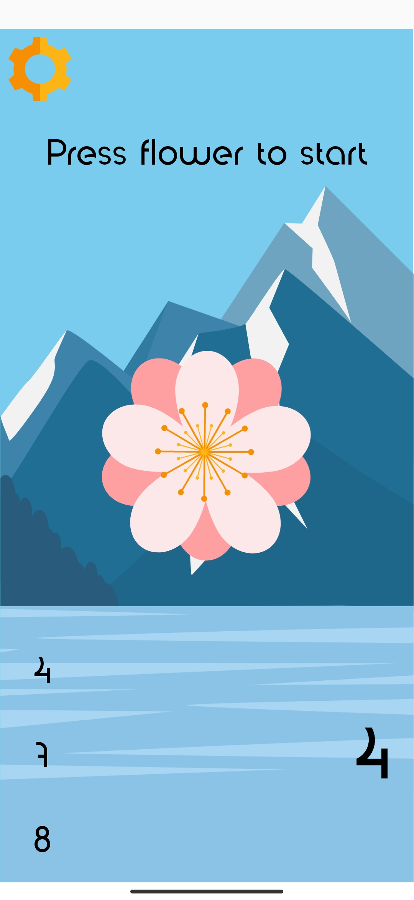
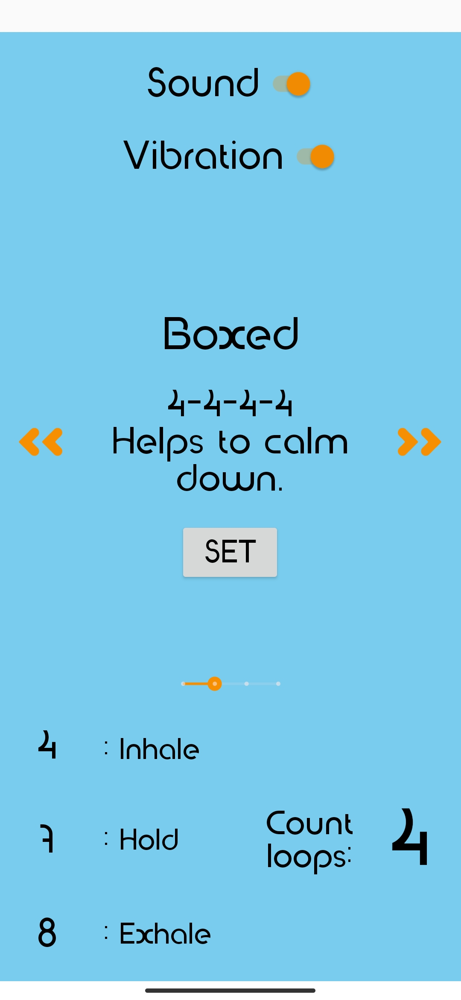

# Экраны приложения

Данное приложение содержит 3 экрана: главное окно приложения, меню настроек и экран работы дыхательного упражнения.

  

Переход между экранами осуществляется через соответствующие кнопки.

Во время выполнения дыхательного упражнения цветок на экране расширяется во время вдоха и сужается во время выдоха.
